# Manuales

Manuales Tecnico y de Usuario del Proyecto 2

En Carpeta Back_Js encontrara el Back End para el analizador lexico y sintactico de Javascript , Carpeta Back_Py encontrara el Back End para el analizador lexico y sintactico de Python, Carpeta Front_Go encontrara el Front End para el servidor de archivos estaticos de Golang.

Descargar carpetas por separado y ejecutar

```bash
npm init
```

## Back End Js Manual Tecnico

Codigo principal del servidor
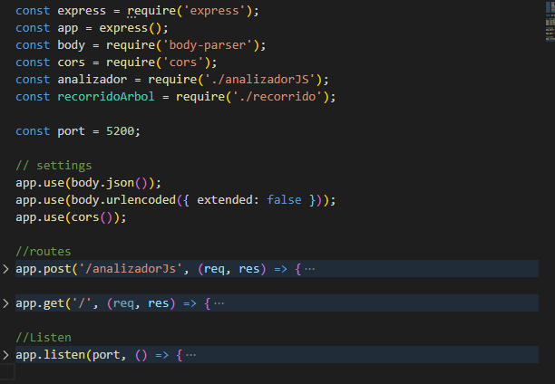

Gramatica de Jison 
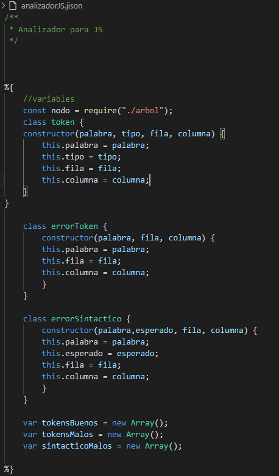

Nodo para generar Arbol dentro de la Gramatica
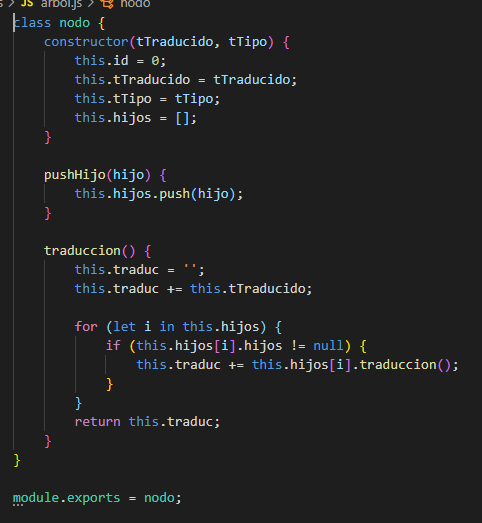

Recorridos usando Nodos del Arbol de la Gramatica
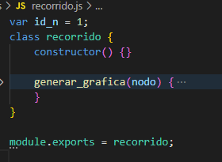


## Front End Go Manual Tecnico

Codigo principal del servidor
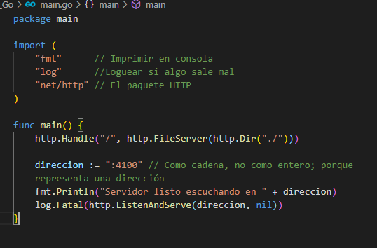

Plantilla de pagina Html
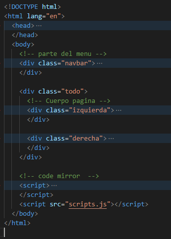

Hoja de estilos de Css
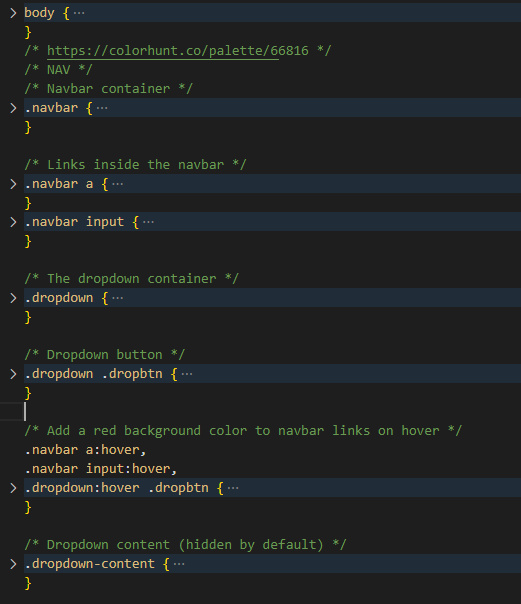

Scripts de la Pagina principal
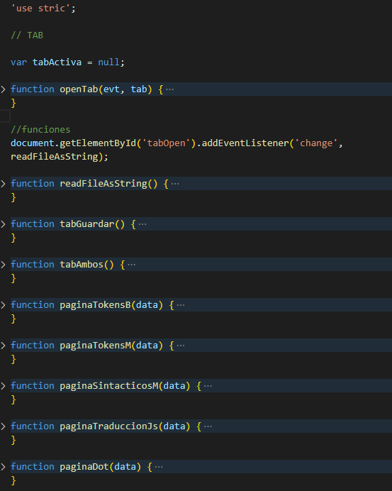

Plantilla de 3d-graphviz pagina
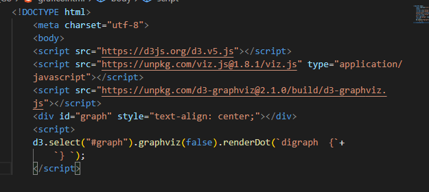

## Back End Py Manual Tecnico

Codigo principal del servidor
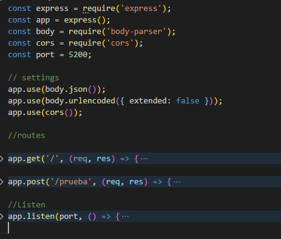

Codigo del analizador Lexico
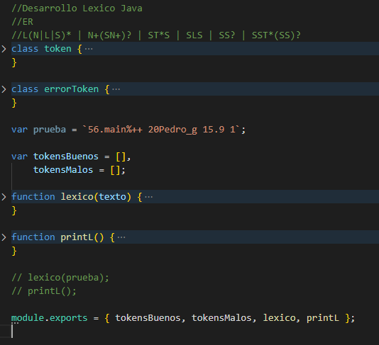

Codigo del analizador Sintactico
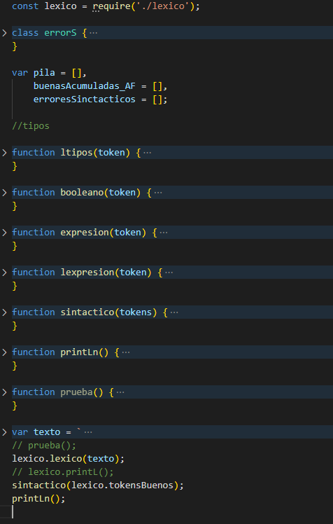


## Front End Go Manual de Usuario

Vista principal del Front end
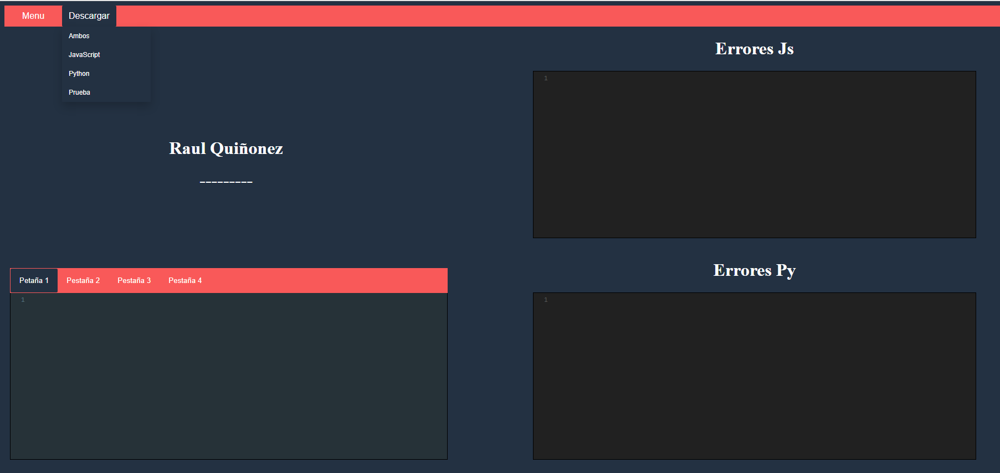

Barra de Menu
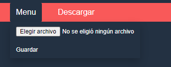

Tabs utilizando CodeMirror
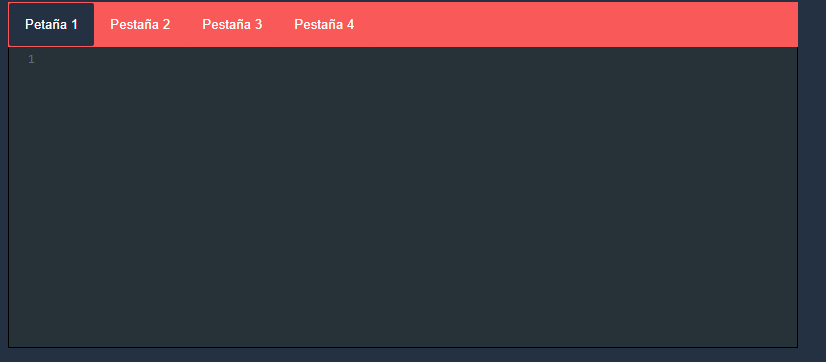
